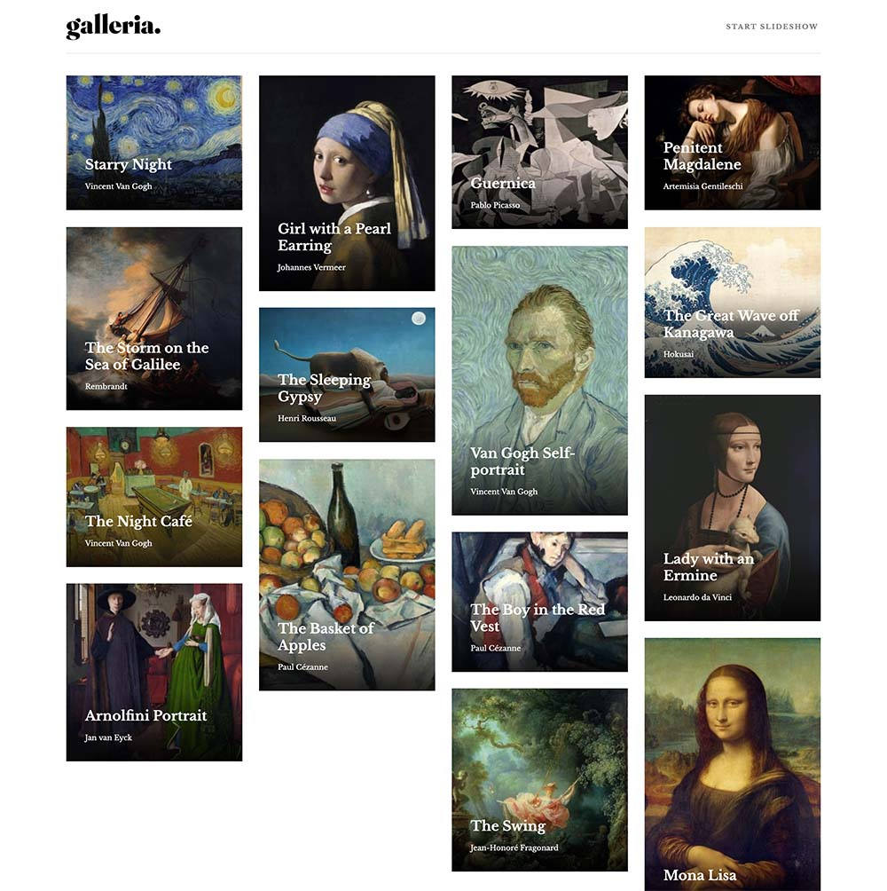

# Frontend Mentor - Galleria slideshow site solution

This is a solution to the [Galleria slideshow site challenge on Frontend Mentor](https://www.frontendmentor.io/challenges/galleria-slideshow-site-tEA4pwsa6). Frontend Mentor challenges help you improve your coding skills by building realistic projects.

## Table of contents

- [Overview](#overview)
  - [The challenge](#the-challenge)
  - [Screenshot](#screenshot)
  - [Links](#links)
- [My process](#my-process)
  - [Built with](#built-with)
  - [What I learned](#what-i-learned)
  - [Continued development](#continued-development)
  - [Useful resources](#useful-resources)
- [Author](#author)

## Overview

### The challenge

Users should be able to:

- View the optimal layout for the app depending on their device's screen size
- See hover states for all interactive elements on the page
- Navigate the slideshow and view each painting in a lightbox

### Screenshot



### Links

- Solution URL: [https://www.frontendmentor.io/solutions/galleria-slide-show-using-vuejs-vuerouter-html-css-js-aQepwM_cC](https://https://www.frontendmentor.io/solutions/galleria-slide-show-using-vuejs-vuerouter-html-css-js-aQepwM_cC)
- Live Site URL: [https://hungry-kirch-a28e81.netlify.app/](https://hungry-kirch-a28e81.netlify.app/)

## My process

### Built with

- Semantic HTML5 markup
- CSS custom properties
- Mobile-first workflow
- [Vue JS](https://vuejs.org/) - JS library
- [Vue Router](https://next.router.vuejs.org/) - Vue Router
- [Macy JS](http://macyjs.com/) - For Masonry Layout

### What I learned

I really learned what Vue JS is all about and what can be accomplished. The learning curve wasn't too bad for using this framework for the first time.

The little snippet below stands out the most to me as it really took me a long time how to get a set interval working within this framework. Overall this challenge was a good experience for me. The only part I did not like is using a plugin for the masonry layout. Masonry layout is still (at the time of this post) in an exprimental phase in firefox and I can't wait for it to be availble.

```js
startSlideShow() {
      let t;
      if (this.startShow && !this.t) {
        this.t = setInterval(this.next, 5000);
      } else {
        clearInterval(this.t);
      }
    }
```

### Continued development

I'll continue to use Vue JS as I like how easy it is to put small sites together quickly.

### Useful resources

- [YouTube](https://www.youtube.com) - YouTube is always open and it's really easy to learn how other people approach code.
- [VueJS](https://vuejs.org/) - For this project I constantly went back to learn all the ins and out of Vue.

## Author

- Website - [Manuel Pena](https://www.mannydevelops.com/)
- Frontend Mentor - [@manolobrown](https://www.frontendmentor.io/profile/manolobrown)
- Twitter - [@manolobrown](https://www.twitter.com/manolobrown)
